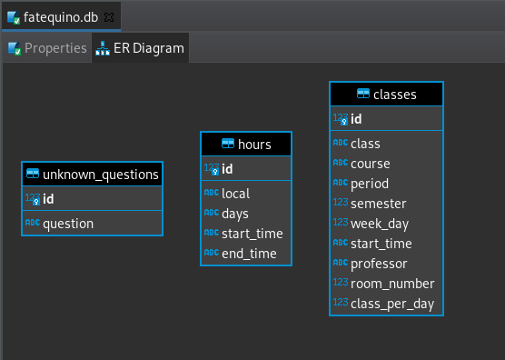

# Fatequino Embedded Version
This project is a Fatequino Chatbot version based on embedded systems to integrate with raspeberry pi for voice and speech recognition

Content Table
=====================

<!--ts-->
* [Dependencies](#dependencies)
* [Code Structure](#code)
* [SQLite](#sqlite)
<!--te-->

<div id="dependencies"/>

Dependencies
=====
<br/>

<!--ts-->
- Python
  - Version: ```3.9.X```
  - Docs: https://www.python.org/doc/
- ChatterBot:
  - Version: ```1.0.4```
  - Docs: https://chatterbot.readthedocs.io/en/stable/
- Chatterbot Corpus:
  - Version: ```1.2.0```
  - Docs: https://chatterbot.readthedocs.io/en/stable/corpus.html
- Speech Recognition:
  - Version: ```3.8.1```
  - Docs: https://pypi.org/project/SpeechRecognition/
- PyAudio:
  - Version: ```0.2.11```
  - Docs: https://pypi.org/project/PyAudio/
- gTTS:
  - Version: ```2.2.3```
  - Docs: https://pypi.org/project/gTTS/
- gTTS:
  - Version: ```Latest```
  - Docs: https://pypi.org/project/mpyg321/
<!--te-->

<div id="code"/>

Code Structure
=====
<br/>
Below we have the code structure based on pattern N-layers or N-modules:
<br/>

```zsh
├── db.sqlite3
├── docs
│   ├── assets
│   │   └── DBTablesFatequino.png
│   └── README.RUN.md
├── fatequino.db
├── file.log
├── main.py
├── requirements.txt
├── response.mp3
└── src
    ├── adapters
    │   ├── class.py
    │   ├── file.py
    │   ├── hours.py
    │   ├── professor.py
    │   ├── __pycache__
    │   │   ├── class.cpython-39.pyc
    │   │   ├── file.cpython-39.pyc
    │   │   ├── hours.cpython-39.pyc
    │   │   ├── professor.cpython-39.pyc
    │   │   └── week_day.cpython-39.pyc
    │   └── week_day.py
    ├── bot
    │   ├── fatequino_chatbot.py
    │   ├── __pycache__
    │   │   └── fatequino_chatbot.cpython-39.pyc
    │   └── trainn
    │       └── conversas.json
    ├── commons
    │   ├── constants.py
    │   ├── __pycache__
    │   │   ├── constants.cpython-39.pyc
    │   │   ├── logging.cpython-39.pyc
    │   │   └── utils.cpython-39.pyc
    │   └── utils.py
    ├── database
    │   ├── sqlite
    │   │   ├── connection.py
    │   │   ├── ddl
    │   │   │   ├── create.py
    │   │   │   ├── index.py
    │   │   │   └── __pycache__
    │   │   │       ├── create.cpython-39.pyc
    │   │   │       └── index.cpython-39.pyc
    │   │   ├── models
    │   │   │   ├── classes.py
    │   │   │   ├── dao.py
    │   │   │   ├── hours.py
    │   │   │   ├── __pycache__
    │   │   │   │   ├── classes.cpython-39.pyc
    │   │   │   │   ├── dao.cpython-39.pyc
    │   │   │   │   ├── hours.cpython-39.pyc
    │   │   │   │   └── unknown_questions.cpython-39.pyc
    │   │   │   └── unknown_questions.py
    │   │   └── __pycache__
    │   │       └── connection.cpython-39.pyc
    │   └── static
    │       ├── aulas.json
    │       └── horarios.json
    ├── services
    │   ├── class_service.py
    │   ├── hours_service.py
    │   ├── __pycache__
    │   │   ├── class_service.cpython-39.pyc
    │   │   ├── hours_service.cpython-39.pyc
    │   │   └── unknown_questions_service.cpython-39.pyc
    │   └── unknown_questions_service.py
    └── speech
        ├── FatequinoInterpreter.py
        └── response.mp3
```

<div id="sqlite"/>

SQLite
=====
<br/>
SQLite is a C library that provides a lightweight disk-based database that doesn’t require a separate server process and allows accessing the database using a nonstandard variant of the SQL query language. Some applications can use SQLite for internal data storage. It’s also possible to prototype an application using SQLite and then port the code to a larger database such as PostgreSQL or Oracle.
<br/>

### Fatequino Tables:

<!--ts-->
- <b>Classes:</b>
    - The classes table is responsible for saving all information about classes at FATEC, such as: teacher, class, semester, period, etc.
- <b>Hours:</b>
    - The schedule table is responsible for saving and maintaining all information about opening and closing times of the FATEC secretary and library
- <b>Unknown Questions:</b>
    - The table of unknown questions saves all the questions that Faequino doesn't know how to answer, to later analyze the questions and train the bot to answer them
<!--te-->
<br/>
Below we have a sample of SQLite implementation on Fatequino code:

#### DAO.py:
- Base abstract class to be implemented by models classes
<br/>

```python
from abc import ABC, abstractmethod
from typing import Any

class DAO(ABC):
    @abstractmethod
    def find_one(self, where: dict) -> tuple:
        pass

    @abstractmethod
    def find_all(self, where: dict) -> tuple:
        pass
    
    @abstractmethod
    def create(self, data: dict, returning = '*') -> tuple:
        pass

    @abstractmethod
    def to_json(self, data: tuple) -> dict:
        pass
    
    @abstractmethod
    def to_json_list(self, data: list) -> list:
        pass
```

#### Classes.py:
- Model class that implement the base class DAO.py and connect with database to make operations.
<br/>

```python
from typing import Any
from src.database.sqlite.models.dao import DAO
from src.database.sqlite.connection import SQLite

OPTIONS = {
    "TABLE": "classes"
}


class Classes(DAO):
    def __init__(self) -> None:
        super().__init__()
        self.sqlite = SQLite()

    def find_one(self, where: dict) -> tuple:
        criteria = []
        try:
            for key in where:
                criteria.append('{}=:{}'.format(key, key))

            query = 'SELECT * FROM {0} WHERE {1} LIMIT 1'.format(OPTIONS['TABLE'], ' AND '.join(criteria))
            row = self.sqlite.execute(query, where)
            return row
        except Exception as e:
            raise e

    def find_all(self, where: dict) -> tuple:
        criteria = []
        try:
            query = 'SELECT * FROM {0}'.format(OPTIONS['TABLE'])

            for key in where:
                criteria.append('{}=:{}'.format(key, key))
            if where != {}:
                query += ' WHERE {}'.format(' AND '.join(criteria))

            row = self.sqlite.execute(query, where)
            return row
        except Exception as e:
            raise e

    def create(self, data: dict) -> tuple:
        try:
            query = 'INSERT INTO {0} ({1}) VALUES ({2})'.format(OPTIONS['TABLE'], ','.join(
                data.keys()), ','.join(list(map(lambda x: '\'{}\''.format(str(x)), data.values()))))
            row = self.sqlite.execute_script(query)
            return row
        except Exception as e:
            raise e

    def to_json(self, data: tuple) -> dict:
        result = {
            "class": data[1],
            "course": data[2],
            "period": data[3],
            "semester": data[4],
            "weekDay": data[5],
            "startTime": data[6],
            "professor": data[7],
            "roomNumber": data[8],
            "classPerDay": data[9]
        }
        return result

    def to_json_list(self, data: list) -> list:
        results = []
        for row in data:
            results.append(self.to_json(row))
        return results

```